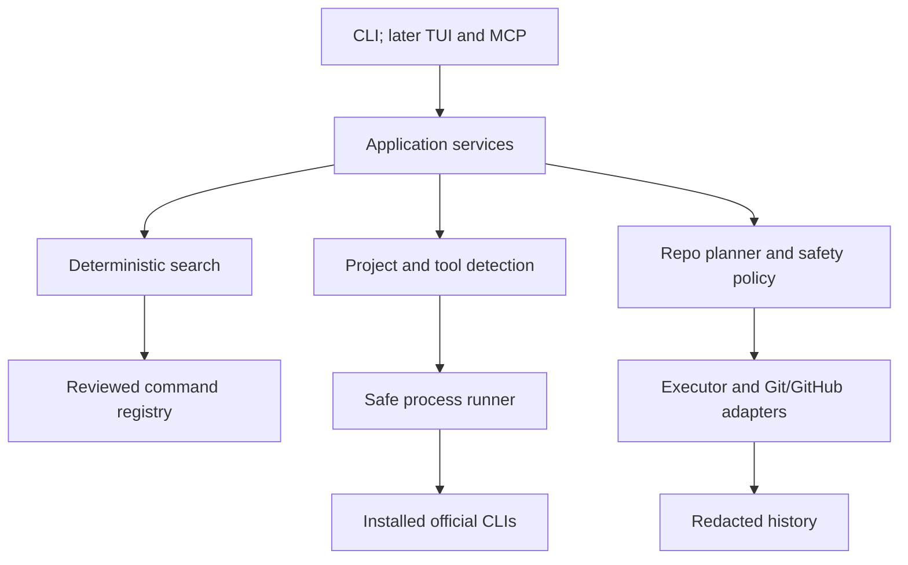

# Devtize

Devtize is an open-source, local-first developer command layer written in Go. The `dvz` CLI provides the completed Phase B self-hosting workflows and the first Phase C daily Git slice: it can inspect local readiness, search a reviewed offline Git command catalog, publish a repository, and create a verified commit behind immutable plans and confirmation. The project is pre-release and its public interfaces may still change.

## Current Features

- `dvz version` reports deterministic build metadata.
- `dvz doctor` checks configuration, project evidence, Git, GitHub CLI, and the built-in registry without making changes.
- `dvz find <intent>` searches reviewed Git knowledge offline and never executes a result.
- `dvz commit` creates a Conventional Commit from explicitly disclosed changed paths.
- `dvz ship` pushes reviewed commits after live fast-forward and stale-plan checks.
- `dvz repo plan` renders the self-hosting repository plan without mutation.
- `dvz repo create` initializes and publishes a repository through reviewed Git and `gh` adapters after confirmation.
- `dvz repo set-description` safely updates existing GitHub repository metadata through a digest-bound plan.
- `dvz repo status` inspects local repository state without mutation.
- Text output and versioned JSON output through `--json`.
- Strict YAML configuration and a context-aware, no-shell subprocess boundary for tool detection and reviewed adapters.

## Command Philosophy

Devtize keeps discovery and execution separate:

```text
dvz find initialize git repository   # implemented: discover only
dvz raw initialize git repository    # roadmap: typed proposal and confirmation
dvz repo create --message "Initial commit" --owner OWNER --name Devtize
                                     # implemented: typed self-hosting workflow
dvz ship                             # roadmap: broader engineered workflow
dvz git status                       # roadmap: policy-controlled tool access
```

Ordinary intent can be entered as trailing words. Quote input only when the shell would interpret metacharacters such as `*`, `$`, `>`, `|`, or `;`. `find` does not offer to run its results.

## Quick Start

Go 1.27 or newer is required.

```sh
go build -o dvz ./cmd/dvz
./dvz --help
./dvz version
./dvz doctor
./dvz find initialize git repository
./dvz commit README.md --message "docs: update readme" --dry-run
./dvz ship --dry-run
./dvz repo plan --owner OWNER --name Devtize --message "Initial commit"
./dvz repo set-description --owner OWNER --name Devtize --description "One universal command layer"
./dvz --json find show working tree changes
```

Shell completion is not shipped in Phase B.

## Architecture



User input, repository files, configuration, CLI output, and command knowledge are untrusted. Phase A command knowledge is discovery data, never execution authority. Every external process used for detection crosses `internal/process` as an executable plus a literal argument array; no shell command string is constructed. See [Architecture](docs/architecture.md) and [Safety](docs/safety.md).

## Safety Model

Knowledge entries describe their effects with one of these risk classes:

| Risk | Intended effect |
|---|---|
| `read_only` | Reads local or provider state |
| `local_write` | Would change local files, Git state, or processes |
| `remote_write` | Would change a remote service or repository |
| `destructive` | Could delete or overwrite difficult-to-recover state |
| `privileged` | Would require elevated operating-system or provider permissions |

`dvz repo create` renders a digest-bound immutable plan before mutation. Large generated-path inventories are grouped by directory in human output, while `--plan-json` retains every exact path. Local-write steps are grouped behind one confirmation, remote repository creation and push use a separate confirmation, and potential-secret warnings require an additional confirmation that `--yes` cannot bypass. `--dry-run` validates and renders without calling mutation adapters. A narrowly guarded `--repair-unpushed-initial` mode can amend exactly one verified unpublished initial commit; it requires an additional digest-bound `repair` response that `--yes` cannot bypass. Devtize may normalize SSH/HTTPS only for the same canonical GitHub repository and the protocol reported by authenticated `gh`; the normal repository workflow never force-pushes, overwrites a different remote target, deletes repositories, or offers general history rewriting.

`dvz repo redact-initial <path>` is the sole post-publication rewrite path. It removes one existing, tracked, ignored local file from a synchronized one-commit repository, preserves the local file, preserves the commit message, and updates the branch only with an exact expected-SHA force-with-lease. It requires digest-bound `redact` and `force-update` confirmations and refuses stale files, stale plans, divergent upstream state, additional commits, and unconditional force.

```bash
dvz repo redact-initial MASTER_IDE_PROMPT.md
```

`dvz repo set-description` inspects the current GitHub description, displays the old and new values in an immutable plan, and requires a digest-bound remote-write confirmation. It skips mutation when the value already matches, refuses a stale plan when the remote value changes, supports `--dry-run` and `--plan-json`, and verifies the result after `gh repo edit`.

`dvz commit [paths...] --message <message>` is the first Phase C daily workflow. It requires Conventional Commit syntax by default, a clean index, an attached branch, exact changed paths, stable file digests, and the digest-bound confirmation word `commit`. With no paths it discloses all current non-ignored changes. `--conventional=false` permits another explicit single-line message. Dry-run and plan JSON never stage or commit.

The first `dvz ship` slice pushes commits that already exist on the current branch. It verifies the configured upstream, live remote SHA, fast-forward ancestry, exact outgoing commits, remote URL, and excluded dirty working paths before requiring the digest-bound confirmation word `push`. It never stages, commits, fetches, rebases, or force-pushes. A rerun verifies the live remote and safely reports no operations when it already matches local `HEAD`.

## Support Matrix

| Provider or area | Level | Notes |
|---|---|---|
| Git installation | detected | Executable and version only |
| Git commands | discoverable | Twelve reviewed built-in entries |
| Git self-hosting capabilities | workflow-ready | Init, inspect, stage, commit, remote verify/add, push through `dvz repo create` |
| Daily Git commit | workflow-ready | Explicit changed-path selection and Conventional Commit validation through `dvz commit` |
| Daily Git ship | executable | Verified push-only first slice through `dvz ship`; checks, commit composition, and PR creation remain planned |
| GitHub CLI (`gh`) | workflow-ready | Auth preflight, repository creation, and guarded description updates |
| Go projects | detected | `go.mod` evidence |
| JavaScript projects | detected | Metadata and recognized lockfile evidence |
| Other runtimes and tools | planned | Not implemented |

Support levels progress through `planned`, `detected`, `discoverable`, `executable`, and `workflow-ready`. Detection never implies execution support.

## Local-First Operation

All Phase A behavior works without AI, network access, hosted services, telemetry, or remote credentials. AI remains disabled in the schema. Ollama and user-provided compatible endpoints are roadmap items and will require explicit configuration and documented context controls before they can receive data.

The reviewed built-in catalog is always available offline. Version-aware help synchronization through a future `dvz sync` command is not implemented; synced help will remain untrusted discovery data and will never become an executable capability automatically. See [Registry](docs/registry.md).

## Configuration

YAML schema version 1 supports color policy, explicitly disabled AI, Phase B confirmation/history defaults, and repository defaults:

```yaml
version: 1
ui:
  color: auto
ai:
  provider: disabled
safety:
  confirm_local_writes: true
  confirm_remote_writes: true
  allow_yes_for:
    - local_write
history:
  enabled: true
git:
  default_branch: main
github:
  visibility: private
```

Project configuration is read from the nearest `.dvz.yaml`. User configuration is stored under the platform configuration directory at `devtize/config.yaml`; `XDG_CONFIG_HOME` is respected when set. Precedence is CLI flags, environment (`NO_COLOR`, `DVZ_COLOR`, `DVZ_AI_PROVIDER`), project config, user config, then defaults. See [Configuration](docs/configuration.md) and [dvz.example.yaml](dvz.example.yaml).

## Development

```sh
test -z "$(gofmt -l .)"
go test ./...
go vet ./...
go build ./cmd/dvz
```

No separate linter is configured in Phase B. CI runs formatting verification, tests, vet, and the build without provider credentials. Git/GitHub mutation tests use temporary repositories, fake process runners, local bare repositories, or fake `gh`; normal CI does not create real GitHub repositories.

## Troubleshooting

- `CONFIG_INVALID`: correct the reported version, unsupported field, or value in user/project configuration.
- `TOOL_NOT_FOUND`: install the named tool if the feature requires it. Missing optional tools are reported by `doctor` without a crash.
- `TOOL_VERSION_UNSUPPORTED`: upgrade the tool to the minimum version shown by `doctor`.
- `CAPABILITY_NOT_FOUND`: make the Git search intent more specific.
- `PLAN_INVALID`: pass a valid repository name, owner, branch, remote, selected path, and `--message`.
- `AUTH_REQUIRED`: authenticate `gh` before remote writes.
- `CONFIRMATION_DECLINED`: rerun and confirm the same plan digest if you want to proceed.
- `PRECONDITION_FAILED`: resolve detached HEAD, unexpected origin, incompatible remote repository, or empty selection.
- `PROCESS_TIMEOUT` or `PROCESS_FAILED`: run `dvz doctor` again and inspect the safe diagnostic; no automatic recovery mutation is attempted.

`dvz doctor` remains conservative. `dvz repo create` performs its own `gh` auth preflight before remote writes.

## Roadmap And Self-Hosting

Phase B is complete. It adds reviewed Git and GitHub adapters and an immutable plan that initialized this folder, disclosed and staged eligible files, committed, created the GitHub repository, configured `origin`, pushed, and verified postconditions. The maintainer completed the guarded initial redaction through Devtize; sanitized evidence is recorded in [docs/self-hosting.md](docs/self-hosting.md).

```sh
./dvz repo create --owner OWNER --name Devtize --visibility private \
  --message "chore: self-host Devtize with Devtize" \
  --repair-unpushed-initial
```

Do not run manual `git init`, `git add`, `git commit`, `gh repo create`, `git remote add`, or `git push` in this folder. After the maintainer-run milestone completes, sanitized evidence should be recorded in `docs/self-hosting.md`.

Later phases cover daily workflows, richer provider knowledge, optional AI, a TUI, and MCP. See [the Phase B plan](docs/plans/phase-b.md) for the current acceptance checklist.

## Contributing, Security, And License

See [CONTRIBUTING.md](CONTRIBUTING.md) for development expectations. Report security issues using [SECURITY.md](SECURITY.md), not a public issue. Devtize is available under the [MIT License](LICENSE).
